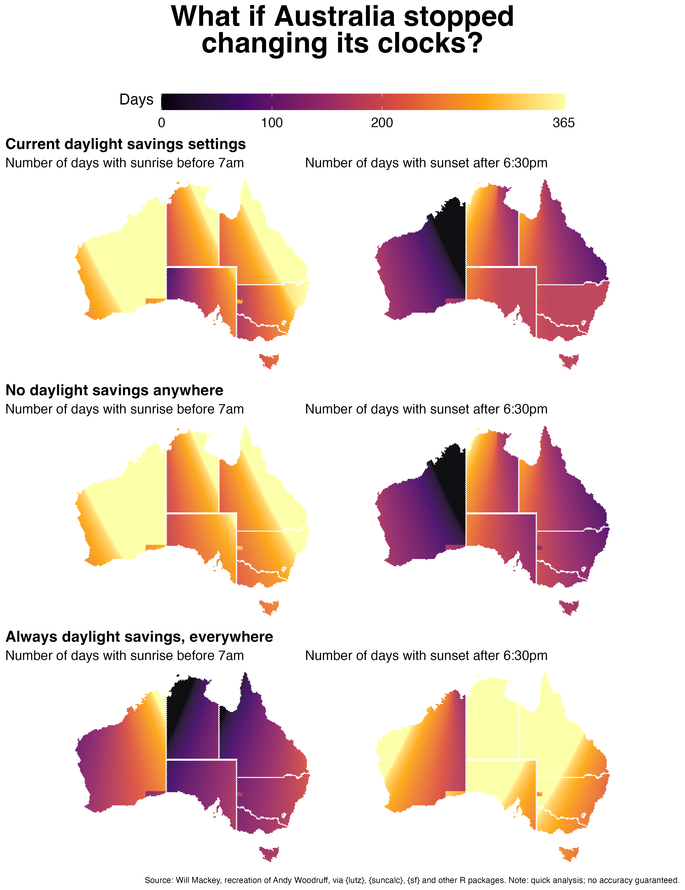

<!-- README.md is generated from README.Rmd. Please edit that file -->

```{r, include = FALSE}
knitr::opts_chunk$set(
  collapse = TRUE,
  comment = "#>"
)
```

# Daylight savings time and sunrises/sunsets in Australia

Recreating this nice chart by Andy Woodruff via Vox: https://twitter.com/voxdotcom/status/1503819992822951945

See `R/make-sun-plots.R` for the code that makes this plot:

```{r, echo=FALSE}

```

